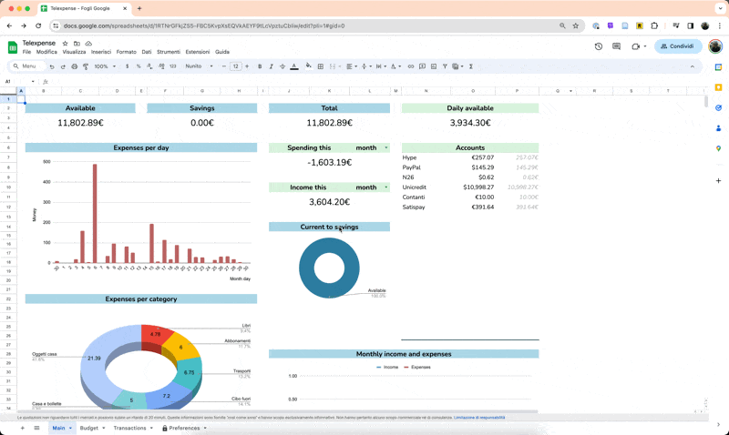

<h1 align="center"> 
Telexpense Visualizer 📊
</h1>
 

This is a basic Streamlit app to visualize your expenses and incomes 
reported using the Telegram bot [Telexpense](https://github.com/pavelmakis/telexpense).

---

The visualizer is accessible [here](), but you can run it locally. In both cases, the Telexpense sheet has to be shared with "Anyone with the link".

# Instructions

To run locally the visualizer:

1. Clone the repo
2. Go to your Telexpense Sheet and set Share -> General Access to "Anyone with the link" 
3. Install python dependencies `pip install -r requirements.txt`
4. Run the local server `python -m streamlit run local.py`
5. The first time, insert the sheet link (this will be saved locally)

# How to share the Sheet

